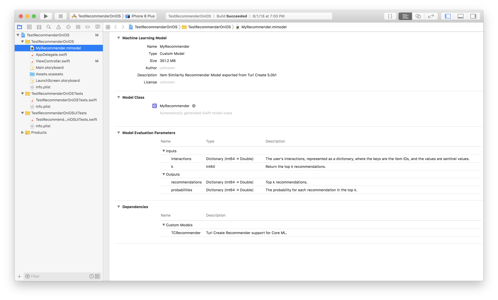
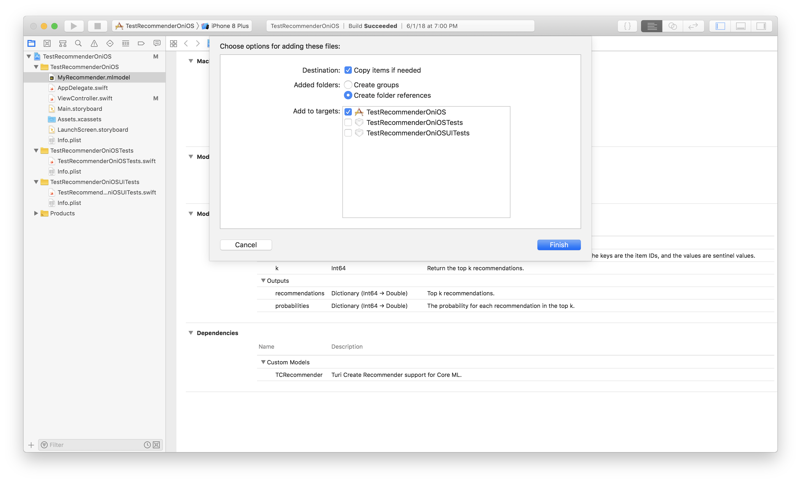

# Deployment to Core ML

***Note:*** *This functionality is only available on iOS 12+ and macOS 10.14+*

The Turi Create Recommender Model is also available for use in your iOS/macOS
apps as a custom model via exporting to Core ML. After creating your model in Turi
Create, save it in Core ML format by calling `export_coreml` API as follows:

```python
# assume my_recommender is the trained Turi Create Recommender Model
my_recommender.export_coreml("MyRecommender.mlmodel")
```

After you drag and drop the exported Core ML model in your iOS app, it will look something like this:


Before you can go ahead and use the recommender model in your app, you must
drag and drop the relevant `.dylib` into your app. If you are writing an app 
for a Mac or an iOS simulator, you would want `libRecommender-x86_64.dylib`. 
If you are writing an iOS app for the iPhone/iPad, you would want 
`libRecommender-arm64.dylib`. 
All the relevant `.dylib` files are available on the 
[Github releases page](https://github.com/apple/turicreate/releases) 
starting with Turi Create 5.0b1. **Please ensure that you rename the respective `.dylib` that you need to `libRecommender.dylib`.**
When you drag and drop the `.dylib`, you must copy all items and create folder 
references. Here is a screenshot of what your selections on the dialog box 
should look like.


Now, do the following:
* Under **Project > Build Phases**, add `libRecommender.dylib` to **Copy Bundle Resources**
* Under **Project > General**, add `libRecommender.dylib` to **Embedded Binaries** and to **Linked Frameworks and Libraries**

Now, you are ready to start writing app code to use the recommender model you
created in Turi Create (and exported to Core ML) in your iOS app. 
As you can see above in the model screenshot in Xcode, you need to give the 
model two inputs, `interactions` and `k`. 

Here is some sample code to demonstrate how to use your exported custom model in a Swift
iOS app. 

* First, we identify the model we dragged and dropped and assign it to a variable. 

```swift
let model = MyRecommender();
```

* We now construct the two inputs we need to give to our model to get back some
predictions.

```swift
let interactions = NSMutableDictionary();
interactions[242] = 6.5; 
// this signifies that the user interacted with item 242 and rated it 6.5 on their scale.
let modelInput = MyRecommenderInput(interactions: interactions as! [Int64 : Double], k: 1);
```

* Now that we have created the input to our `MyRecommender` model, we call `prediction`
on it to look at the model predictions. 

```swift
guard let modelOutput = try? model.prediction(input: modelInput) else {
    fatalError("Unexpected runtime error.");
}
print(modelOutput.probabilities);
print(modelOutput.recommendations);

```

The code sample above is just to give you an idea of how to use the recommender model.
The apps that use recommender models can vary across lots of different use cases. 
Examples include providing recommendations to the user for objects to purchase 
in a game, recommendations to help users create their avatars, and so on.
